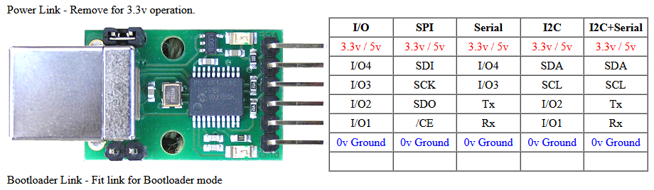
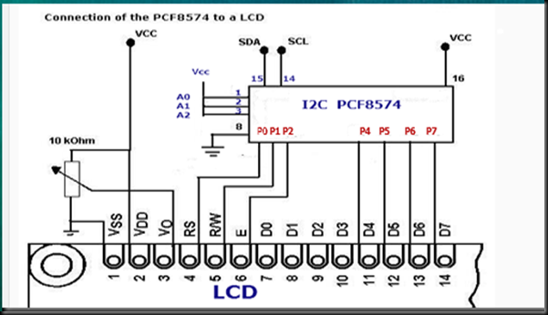
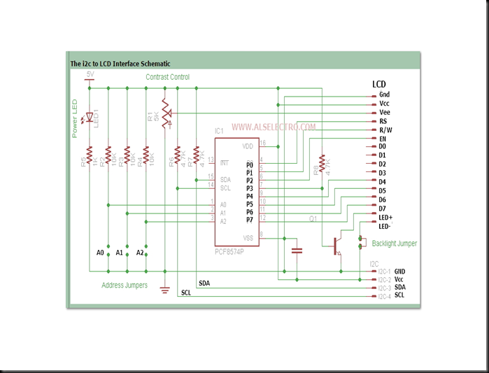

What's this ??

This is an (successfull) attempt to get an I2C interface on a Windows Pc and control it through an C# application. The interface used is relative cheap and connects through USB, where it emulates a serial port, which is then controlled by this example app.

USB-ICC:

https://www.robot-electronics.co.uk/htm/usb_iss_tech.htm

Docu:
    https://www.robot-electronics.co.uk/htm/usb_iss_tech.htm &
    https://www.robot-electronics.co.uk/htm/usb_iss_i2c_tech.htm

Pinout:

Pinout LCD:

    Ground
    VCC +3.3 to +5V (typical)
    Contrast adjustment (VO) This is an analog input, typically connected to a potentiometer. The user must be able to control this voltage independent of all other adjustments, in order to optimise visibility of the display that varies i.a. with temperature, and, in some cases height above the sea level. With a wrong adjustment the display will seem to malfunction.
    Register Select (RS). RS=0: Command, RS=1: Data
    Read/Write (R/W). R/W=0: Write, R/W=1: Read (In most applications reading from the HD44780 makes no sense. In that case this pin can be permanently connected to ground and no io pins need to be allocated to steer it.)
    Clock (Enable). Falling edge triggered
    Bit 0 (Not used in 4-bit operation)
    Bit 1 (Not used in 4-bit operation)
    Bit 2 (Not used in 4-bit operation)
    Bit 3 (Not used in 4-bit operation)
    Bit 4
    Bit 5
    Bit 6
    Bit 7
    Backlight Anode (+) (If applicable)
    Backlight Cathode (-) (If applicable)

(taken from: https://alselectro.wordpress.com/2016/05/12/serial-lcd-i2c-module-pcf8574/)

So:
- __BCK__  - __LCD__
- P0  - RS
- P1  - R/W
- P2  - EN
- P3  - BL (backlight)
- P4 -  D4
- P5 -  D5
- P6 -  D6
- P7 -  D7

